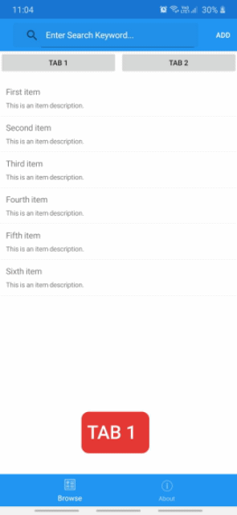

# Xamarin Forms: SearchBar and Tab Button

## Description
I was create Xamarin Forms project and named it as SearchPage. In this project, I created Search function using SearchBar Tag of XAML, Using this we can search Items into list.

Then, i added one more feature like Tab button in one page without using any xamarin packages. Using this tab button we can change list view.

